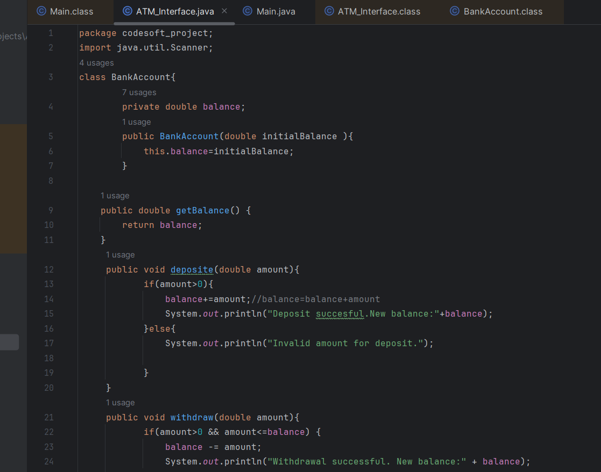

# CODESOFT--ATM-Interface-java-
The ATM Interface in Java is a robust, user-friendly application facilitating secure financial transactions. It employs object-oriented principles, ensuring a modular design for efficient code maintenance and extensibility.

                                                 **   Welcome to the Project!**
 Welcome to my awesome project! Here's a screenshot:

 
(output/BankAccount.class.png)

## Watch the Demo Video

[![Watch the Demo Video][(https://img.youtube.com/vi/YOUTUBE_VIDEO_ID_HERE/0.jpg](https://drive.google.com/file/d/1IVEvWcO0f5q4NsSmbu8ZHzeLyHUotUi_/view?usp=sharing))](https://www.youtube.com/watch?v=YOUTUBE_VIDEO_ID_HERE)

## Project Overview

**
Bank ATM Simulation Project**
**Overview:**
This Java project simulates a basic ATM system with a console interface. The system comprises two main classes - BankAccount and ATM. The BankAccount class manages account-related operations, while the ATM class handles user interactions through a console-based menu.

**Class Details:**
**1. BankAccount Class:**
Manages the bank account functionalities.
Attributes:
private double balance: Represents the account balance.
**Constructor:**
public BankAccount**(double initialBalance)**: Initializes the account with the specified initial balance.
Methods:
public double getBalance(): Retrieves the current account balance.
public void deposit**(double amount)**: Deposits the specified amount into the account.
public void withdraw**(double amount)**: Withdraws the specified amount from the account.
2.** ATM Class:**
Orchestrates the ATM functionalities and user interactions.
Attributes:
private BankAccount account: Represents the user's bank account.
private Scanner scanner: Handles user input.
**Constructor:**
public ATM(BankAccount account): Initializes the ATM with a user's bank account.
Methods:
public void showMenu(): Displays the ATM menu options.
public void run(): Executes the ATM operations based on user input.
private void checkBalance(): Displays the current account balance.
private void deposit(): Facilitates the deposit operation.
private void withdraw(): Facilitates the withdrawal operation.
3. ATM_Interface Class:
Contains the main method to initiate the ATM simulation.
Methods:
public static void main(String[] args): Entry point of the program.
Usage Instructions:
Clone the Repository:

**bash
Copy code
git clone https://github.com/yourusername/ATM_Simulation.git
cd ATM_Simulation
Compile and Run:**

Use a Java IDE (Eclipse, IntelliJ) or compile from the command line.
Run the ATM_Interface class to start the ATM simulation.
Follow Console Instructions:

Enter a four-digit PIN when prompted.
Choose options from the displayed menu to check balance, deposit, withdraw, or exit.
Disclaimer:

This simulation is for educational purposes and lacks real-world security measures. Avoid using actual PINs and sensitive information.

 
